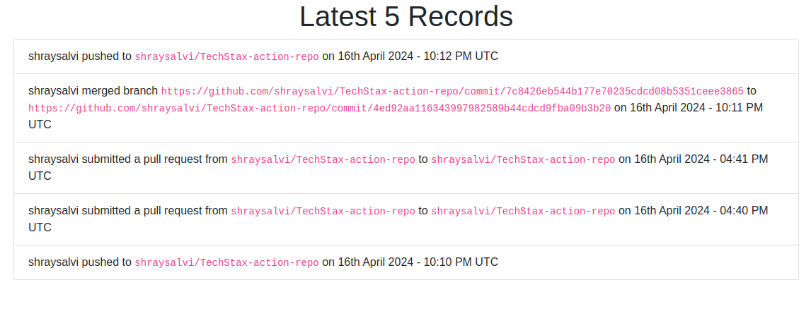

# Developer Assessment Task

End Result



## Introduction

This task is designed to assess your skills in building a webhook receiver and displaying data on a UI using Flask, MongoDB, and GitHub webhooks. I personally think that it was just an implementation of CI/CD.

## Problem Statement
Build a GitHub repository that automatically sends webhook events for the following GitHub actions ("Push", "Pull Request", "Merge") to a registered endpoint and stores it in MongoDB. The UI should continuously fetch data from MongoDB every 15 seconds and display the latest changes in a specific format.

## Action Formats:
#### PUSH action:
- Format: {author} pushed to {to_branch} on {timestamp}
- Sample: "Travis" pushed to "staging" on 1st April 2021 - 9:30 PM UTC
#### PULL_REQUEST action:
- Format: {author} submitted a pull request from {from_branch} to {to_branch} on {timestamp}
- Sample: "Travis" submitted a pull request from "staging" to "master" on 1st April 2021 - 9:00 AM UTC
#### MERGE action:
- Format: {author} merged branch {from_branch} to {to_branch} on {timestamp}
- Sample: "Travis" merged branch "dev" to "master" on 2nd April 2021 - 12:00 PM UTC

## How to run
Just hit this command in terminal
```bash
docker compose up
```
You are good to go! Just make sure you have Docker installed before you start.

## Submission Details
- Create two GitHub repositories: [action-repo](https://github.com/shraysalvi/TechStax-action-repo) to handle GitHub actions using webhooks, and [webhook-repo](https://github.com/shraysalvi/TechStax-webhook-repo) for the endpoint where webhook endpoint code is written to capture changes from action-repo.
- Customize the provided base code according to the requirements. But the case was found to be bit old, hence implemented my own codes where needed.
- I used ajax for getting content from mongodb every 15 secounds.

